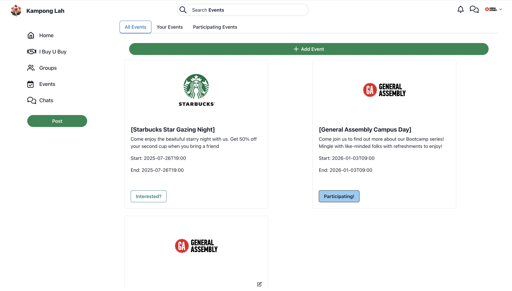

# Kampong Lah (neighbourhood app)
 

 
 

This is a proof-of-concept for a neighbourhood social network in Singapore.

[demo on Vercel](https://sglocals-frontend-c8kb.vercel.app/)

**Next Steps**:
  - Merchant account integration
  - Comments-on-comments
  - Zod data validation
  - Completed search feature

**Tech Stack**:
**MERN stack** - **Pusher** - **Clerk** - **Cloudinary** - **Fuse.js**

**See individual files for citations/useful resources**

